# Tech2Check: what if we broadened eligibility to young adults?

## What this looks at

The youth-only program is small: it averts about **2.6 infections**
statewide over 2026-2030, because diagnosed youth are only ~1% of
Maryland’s epidemic. Young adults (25-34) are the obvious next group to
add, with far more diagnosed HIV.

So: **if the program also enrolled 25-34s, how much more could it
avert?** A youth trial cannot say whether the same program works in
adults, so we ran it three ways: the adult effect **fully** transports,
**half**, or **not at all**.

## How much more could it avert, and why

Each point below is the median infections averted over 2026-2030 under a
different assumption about the adult effect. “Transport” is how much of
the trial’s youth benefit carries to adults: **full** = the same
suppression odds ratio the trial found in youth (2.0 active, 1.0 once
distant), **half** = 1.5, **none** = 1.0.

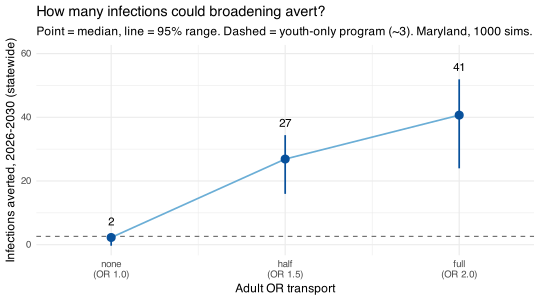

Full transport averts about **41** infections, roughly **15x**
youth-only; half lands around **27**; no adult benefit sits right on the
youth-only line. All three enroll the same adults and differ only in the
adult effect, so the spread is entirely about transport.

What moves the number is reach: the diagnosed 25-34 pool is roughly
**11x** the youth pool, so enrollment jumps once adults are eligible.

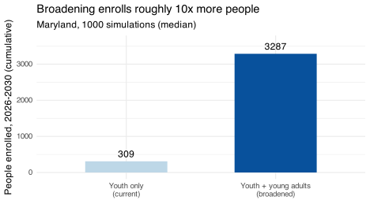

That reach is what drives the upper end of the range, though only if
adults actually benefit.

## The catch

The big number rests on two things the youth trial does not establish:

1.  **Does the effect transport?** The trial measured suppression in
    *youth*. Whether it helps 25-34s as much is unknown, and that is the
    entire spread: full transport ~41, none ~2.6 (today’s number).
    Everything below is conditional on where the truth sits in that
    range.
2.  **Would adults take it up the same way?** We assumed adults enroll
    and stay in the program like youth. Lower adult uptake shrinks the
    reach advantage, and the impact.

## What it looks like on the epidemic

Even at the top of the range, the effect is **small against the whole
epidemic**, about a 1-2% dip in new infections. On the incidence curve
the two lines essentially overlap, since calibration uncertainty dwarfs
the program’s effect.

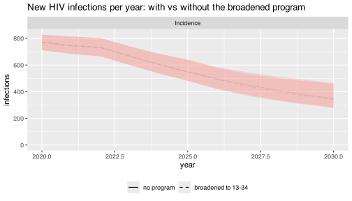

The averted *count* rises a lot in relative terms (2.6 to ~41), but it
stays a modest share of Maryland’s incidence: a genuine gain, not a
visible bend in the curve.

## How far to broaden

If 25-34 helps, why not more adults? Because the diagnosed pool is
heavily older: people 55 and older are half of all diagnosed HIV in
Maryland.

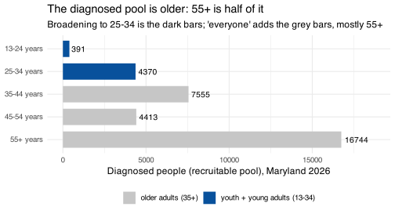

So reaching **everyone** would be driven mostly by 55+, where a program
built for youth (a digital tool plus community health navigators) is
least likely to work. But the next band, **35-44, is the second-largest
pool and a far more plausible target**. Extending to everyone under 44
(13-44) averts about **113** infections under full transport, nearly
three times the 25-34 number:

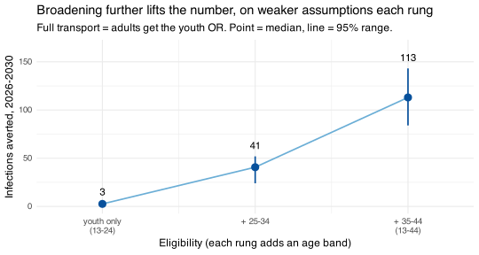

Each rung adds real averted, but on a weaker transport assumption than
the last (youth trial, to young adults, to mid-adults). Under-44 is the
defensible top; “everyone” would add more on the least-credible 55+
assumption, a structural ceiling rather than a plan. And every rung
stays conditional: with no transport, even 13-44 averts only about 2,
like today.

## Does running the program longer help?

Some, but with diminishing returns. Doubling the horizon (five years to
ten) lifts the totals by about 1.4-1.6x, not 2x, because the averted
share shrinks as the epidemic declines:

| Program length          | Youth only | Broadened (full transport) |
|:------------------------|:-----------|:---------------------------|
| 5 years (through 2030)  | 2.6        | 40.7                       |
| 10 years (through 2035) | 4.2        | 55.5                       |

Cumulative infections averted, Maryland. Doubling the program’s length
adds about 1.4-1.6x, not 2x, because the averted share shrinks as the
epidemic declines.

The mechanism is simply that Maryland’s incidence is already declining,
so a program holding a roughly constant *share* of infections averts
fewer of them each year.

## Bottom line

- Youth-only impact is small because the eligible group is small.
- **Broadening the age range is the lever that moves the number.** It
  forms a ladder: ~2.6 (youth only) to ~41 (add 25-34) to ~113 (add
  35-44) under full transport, each rung on a weaker transport
  assumption than the last. “Everyone” adds more, but on the 55+ group
  where a youth program is least likely to work.
- **All of it is conditional** on the effect transporting and adults
  enrolling. With no transport, even the broadest program averts ~2,
  like today.
- **Running longer helps only modestly**: doubling the horizon adds
  about 1.4-1.6x, not 2x, as the epidemic declines.
- So the real question is not “should we broaden?” but **“does
  Tech2Check work in these older groups, and would they enroll?”**
  Evidence on that turns the ladder into a projection.

## Trajectories (for reference)

Time-series overlays for sanity-checking model behavior, with each
outcome shown at both broadening levels (13-34 then 13-44) so the wider
bracket’s effect on the curve is easy to compare. Each plot is the
broadened program against its own no-program run (full transport).

**New HIV infections (incidence).**

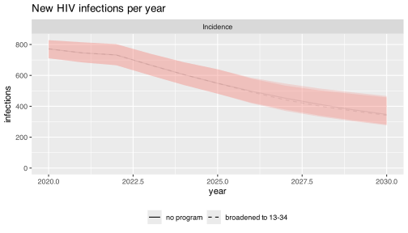

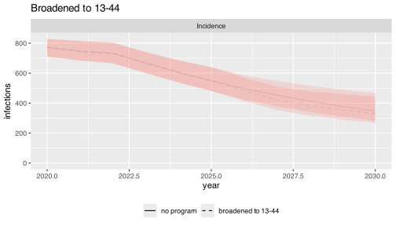

The wider bracket helps a touch more visibly: the 13-44 line dips just
below no-program in the later years, a bit more than 13-34 does above.
But the gap is still well inside the calibration band, so even ~113
averted reads as a small effect, not a visible bend in the curve. The
same near-overlap holds for diagnoses and deaths below.

**New HIV diagnoses.**

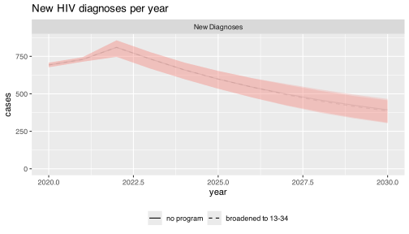

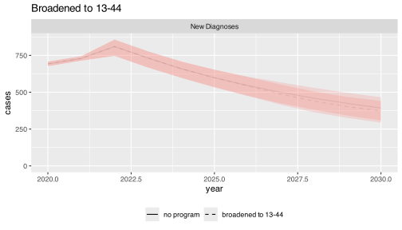

**HIV deaths (mortality).**

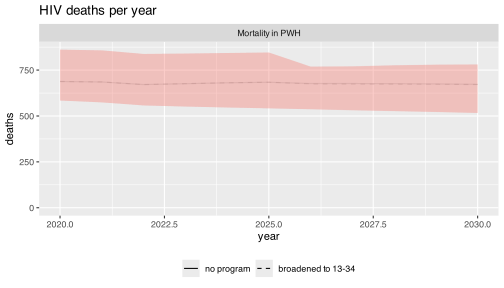

**Viral suppression among diagnosed.**

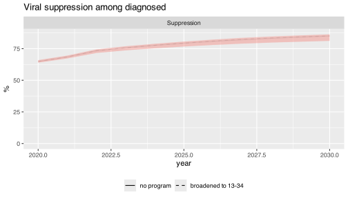

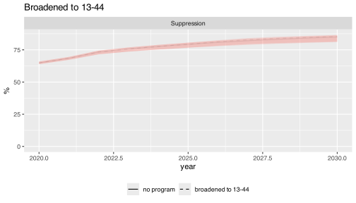

**Program enrollments per year.**

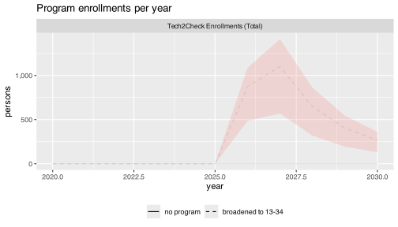

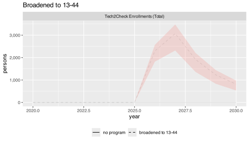

**Enrollments by age band.** Broadening to 25-34 fills two bands (13-24
and 25-34); extending to 35-44 fills a third.

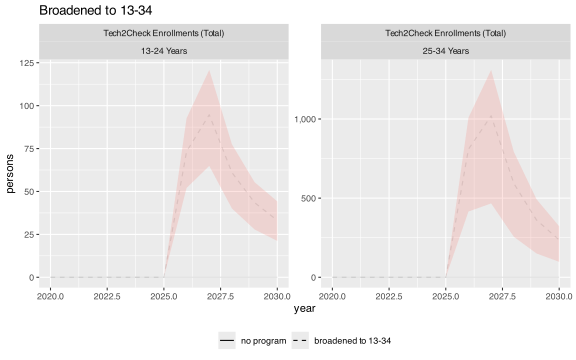

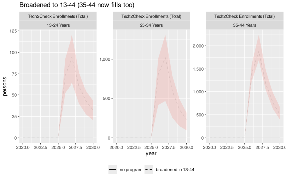

**Viral suppression by age band.**

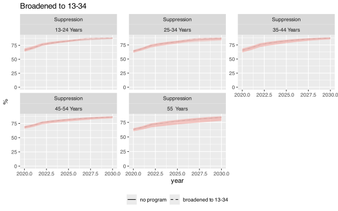

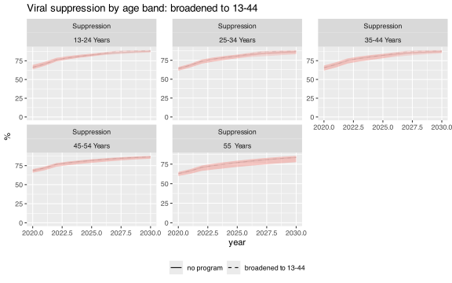
