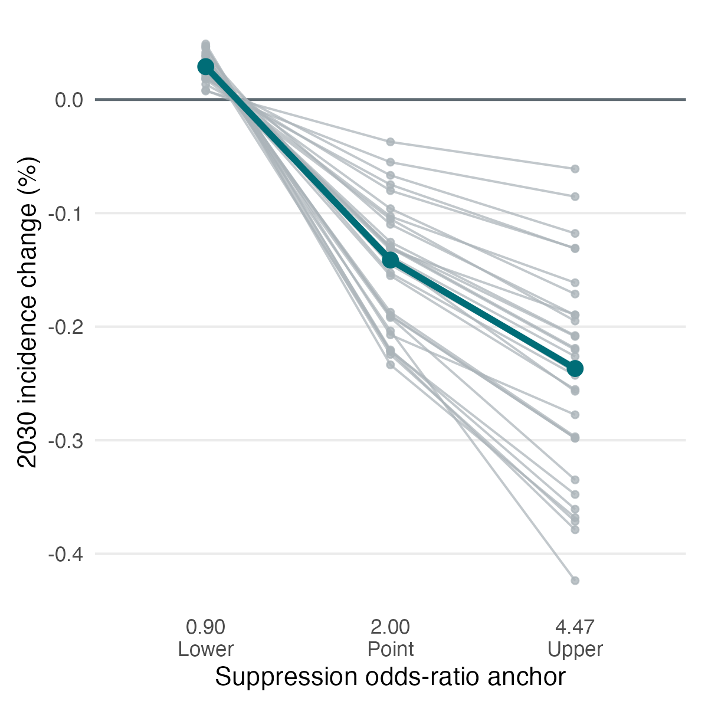

# CROI 2027 abstract — draft for team review

Proposed title: Youth HIV Adherence Scale-Up Has Limited Population Impact Across 31 US Jurisdictions

Suggested category: P — Childhood and Adolescent HIV and Emerging Viral
Infections

Possible search terms: HIV; youth; viral suppression; mathematical modeling;
implementation

Submission deadline: October 1, 2026

Official requirements: <https://www.croiconference.org/abstract-guidelines-and-submission/>

<!-- CROI-BODY-START -->
## Background

Digital adherence interventions may improve viral suppression among adolescents and young adults with HIV, but their population impact when scaled across heterogeneous US epidemics is unknown. We estimated the impact of one-course Tech2Check scale-up across 31 jurisdictions and tested sensitivity to the uncertain trial effect.

## Methods

We used JHEEM, a dynamic compartmental HIV model stratified by age, race, sex, and transmission risk and calibrated to 31 US jurisdictions. During 2026–2030, all diagnosed people aged 13–24 were eligible once, with recruitment at 0.5/year. While receiving or recently completing the intervention, suppression odds were multiplied by 2.00, the trial point estimate; no distant effect was assumed. For each jurisdiction, 1,000 calibrated posterior draws were compared with matched no-program counterfactuals. Fixed suppression odds ratios of 0.90 and 4.47 represented trial lower and upper anchors; they were not treated as a probability distribution. We estimated cumulative infections averted, 2030 incidence change, enrollment, and impact per 1,000 enrollments. Surveillance-linked youth-stock scaling tested age-allocation sensitivity.

## Results

All jurisdictions passed prespecified model checks. At OR=2.00, median cumulative infections averted was 3.07 across jurisdictions (range of jurisdictional medians, 0.79–43.46); 2030 incidence declined 0.04%–0.23%. Absolute impact strongly tracked cumulative enrollment (Pearson r=0.968; Spearman rho=0.943), while infections averted per 1,000 enrollments ranged 8.82–23.38. At OR=0.90, all jurisdictions experienced slight harm: median infections averted was −0.59 (range, −8.37 to −0.15) and incidence increased 0.01%–0.05%. At OR=4.47, all benefited: median infections averted was 5.09 (range, 1.36–72.66), yet incidence declined only 0.06%–0.42%. Surveillance-linked youth-stock scaling of the OR=2.00 result increased the cross-jurisdiction median to 4.31 and preserved ordering (rho=0.987).

## Conclusions

Across trial-effect anchors, the direction and magnitude of projected impact changed, but not the conclusion that one-course youth-only scale-up has limited statewide epidemic effect: even the optimistic anchor reduced incidence by less than 0.5% everywhere. Achieving larger population effects would likely require broader reach and evidence that uptake and efficacy transport beyond the trial population.
<!-- CROI-BODY-END -->

## Optional figure for consideration

Proposed caption: Projected 2030 incidence change across 31 jurisdictions under
fixed trial lower, point, and upper suppression-effect anchors. Gray lines are
jurisdictions; the teal line is the cross-jurisdiction median. Negative values
indicate reduced incidence.
