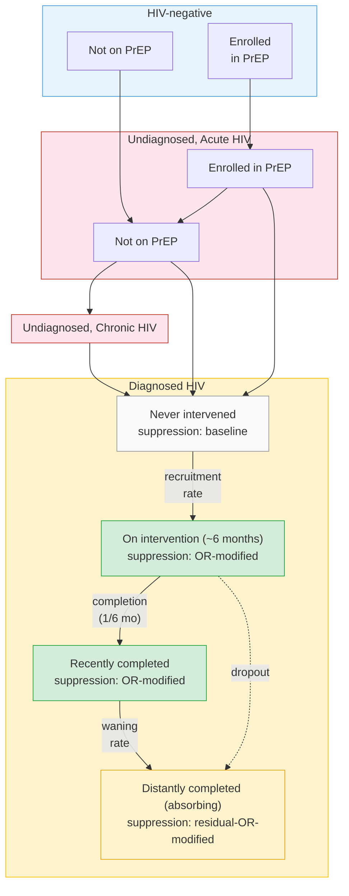

# Tech2Check Model Design

## Overview

We extend JHEEM by adding an **intervention dimension** to the diagnosed HIV compartments, modeling the Tech2Check program as a sequence of states that individuals move through. The goal is to estimate the population-level reduction in HIV transmission if Tech2Check were scaled to diagnosed youth with HIV under a given age threshold, under varying assumptions about recruitment rate and eligibility.

## The Intervention

Tech2Check is a 24-week program combining community health nursing (CHN) visits with a smartphone app (eMocha) for youth with HIV (ages 12-25) who have detectable viral load. The primary trial (Agwu et al., N=76) found an overall odds ratio for viral suppression of 2.0 (95% CI 0.90-4.47) in the intervention arm vs. standard of care.

## Compartment Structure

We add a new **intervention status** dimension to the existing diagnosed HIV compartments. This dimension has 4 states:

```
Never intervened  -->  On intervention  -->  Recently completed  -->  Distantly completed
   (eligible)          (active program)      (effect sustained)       (effect waned)
   default state        ~6 months dwell       variable dwell          absorbing
```

JHEEM represents viral suppression within diagnosed HIV as a **proportion** attached to each compartment, not as a separate sub-compartment. Each of the 4 intervention states carries its own suppression proportion; the intervention effect is applied by modifying that proportion in the affected states (see "Applying the Intervention Effect" below). A schematic diagram is provided at the end of this document.

### State Definitions

| State | Description | Suppression |
|-------|-------------|-------------|
| **Never intervened** | Default state for all diagnosed individuals in eligible age range. Eligible for recruitment. | Baseline (no modification) |
| **On intervention** | Currently enrolled in the active 24-week program. | Enhanced (OR applied) |
| **Recently completed** | Completed the program; behavioral change sustained. | Enhanced (same OR in base case; sensitivity allows reduced OR) |
| **Distantly completed** | Completed program long ago. Cannot re-enroll. | Residual OR (sensitivity parameter, 1.0 base case to 1.3 upper bound) |

### Transitions

| Transition | Rate | Notes |
|------------|------|-------|
| Never → On | Recruitment rate | **Primary policy lever.** Applied to diagnosed, age-eligible population. Varied in scenarios. |
| On → Recently | 1/(6 months) | Fixed, based on program duration. |
| On → Distantly | Dropout rate | Based on trial completion rates (~80-90% completed all visits). |
| Recently → Distantly | Waning rate | **Key sensitivity parameter.** Governs how long the full effect persists. |

### Applying the Intervention Effect

Let `p` denote the baseline suppression proportion in the affected compartment. The OR is applied directly to `p` on the odds scale:

```
baseline odds = p / (1 - p)
new odds      = OR × baseline odds
p'            = OR × p / (1 - p + OR × p)
```

The baseline suppression proportion evolves over time in the calibrated model; the intervention-modified proportion tracks whatever the baseline is at each timepoint, so the effect size adjusts automatically as standard of care changes.

Recruitment is from the whole diagnosed, age-eligible population. The OR was estimated in a 100%-viremic trial cohort and is applied here to a compartment with a mixed baseline suppression proportion, which is an extrapolation. Two features bracket this uncertainty: (i) the OR-on-odds formulation has a built-in ceiling effect — the population-level boost `(p' − p)` diminishes as baseline `p` rises — and (ii) conservative values of the OR (in particular the lower 95% CI bound, 0.90) are included in the sensitivity analysis to bracket residual transportability uncertainty.

### Key Parameters

| Parameter | Base case | Range for sensitivity | Source |
|-----------|-----------|----------------------|--------|
| Suppression OR (On) | 2.0 | 0.90 - 4.47 | Trial overall GLMM estimate + 95% CI (Agwu et al.) |
| Suppression OR (Recently) | 2.0 (same as On) | 1.5 (~25% attenuation post-active phase) | Base case favors parsimony; sensitivity reflects literature pattern of attenuation post-withdrawal ([Kanters 2017](https://pubmed.ncbi.nlm.nih.gov/27863996/), [Johnson 2007](https://pubmed.ncbi.nlm.nih.gov/18193499/), [Taiwo 2010](https://pubmed.ncbi.nlm.nih.gov/20418724/)) |
| Residual OR (Distantly) | 1.0 (full reversion) | up to 1.3 | Full reversion is the dominant pattern in post-withdrawal data ([Johnson 2007](https://pubmed.ncbi.nlm.nih.gov/18193499/), [Taiwo 2010](https://pubmed.ncbi.nlm.nih.gov/20418724/), [Kalichman 2016](https://pmc.ncbi.nlm.nih.gov/articles/PMC4981529/), [Kanters 2017](https://pubmed.ncbi.nlm.nih.gov/27863996/) meta-analysis); [Stecher 2021](https://pmc.ncbi.nlm.nih.gov/articles/PMC8122069/) supports a modest residual only in a habit-forming subgroup (~19%). Upper bound of 1.3 represents an optimistic "partial permanent benefit" scenario. |
| Waning rate (Recently → Distantly) | 1/year (= 12mo mean duration of full benefit) | 1/(3 months) to 1/(3 years) | Lower bound: empirical ([Johnson 2007](https://pubmed.ncbi.nlm.nih.gov/18193499/): dissipation 5-10mo; [Taiwo 2010](https://pubmed.ncbi.nlm.nih.gov/20418724/): waned by week 48; [Demonceau 2013](https://pubmed.ncbi.nlm.nih.gov/23588595/): ~1%/month decay across chronic diseases). Upper bound: modeling precedent ([Alsallaq 2013](https://pubmed.ncbi.nlm.nih.gov/23372738/)), no empirical support beyond ~1yr in HIV behavioral interventions. |
| Recruitment rate | Scenario lever | 5%, 10%, 20% of eligible per year | Policy assumption |
| Age eligibility threshold | Scenario lever | <25 (matches trial age range); <30 reported as extrapolation with caveat | Policy assumption. The trial enrolled ages 12-25, so scenarios extending eligibility beyond 25 apply the OR outside its estimation age range. |
| Dropout rate (active phase) | ~0.33/year | Fixed | Trial CHN visit completion: ~15% non-completion over 6 months. Converted to rate via `r = −ln(1 − 0.15)/0.5yr ≈ 0.33/year`. Implemented as On → Distantly transition. |

## Open Items

- **Subgroup heterogeneity.** Should the OR vary by race, sex, risk? Trial was 92% Black, 64% male — generalizability is a concern. Default: apply OR uniformly, note limitation.
- **Calibration alignment (numerical).** Does JHEEM's calibrated baseline suppression proportion for the recruited population differ substantially from the trial control arm? If so, whether and how to adjust. To verify during implementation.

## Diagram

The diagram below extends the existing JHEEM model schematic with the proposed Tech2Check intervention compartments (green) nested within diagnosed HIV. Each state is annotated with its effective suppression proportion.



> **Reading the diagram:** Green boxes have the full intervention effect, applied as an OR-modification to the baseline suppression proportion. The yellow "Distantly completed" box has a residual OR that is a sensitivity parameter, ranging from 1.0 (full reversion to baseline, base case) to 1.3 (optimistic partial permanent benefit, upper bound from the verified literature). The grey box uses the baseline suppression proportion. Dashed arrow = dropout.
