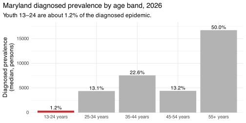

# Tech2Check — initial intervention results

## What this shows

Initial result from running the calibrated **Tech2Check intervention on
Maryland state-level baselines** (1000-sim posterior, sustained
recruitment over 2026–2030). Maryland state is the modeled geography
because current-spec MSA calibration is not yet available.

Pipeline runs end-to-end. Structural invariants (pre-intervention
bit-identity between scenarios, compartment non-negativity, closed-form
verification of the OR-modified suppression, no-intervention re-run
fidelity) and directional regime checks (mortality direction under OR \>
1, adult-cohort spillover bounded) all pass. As concrete examples:
pre-intervention trajectories match between scenarios with max abs diff
= 0 across EHE outcomes for years before 2026 (a clean comparison
baseline); the OR-modified suppression matches the closed form OR·p / (1
− p + OR·p) per stratum to within 3.2 × 10⁻³ relative deviation (against
a 5 × 10⁻³ tolerance, checked across ~136K stratum-cells
post-activation).

The simulated scenario is sustained recruitment of diagnosed-chronic
youth (13–24) into the four-state lifecycle
(`on_intervention → recently_intervened → distantly_intervened`), with
the trial OR (default 2.0) applied to suppression in `on_intervention`
and `recently_intervened` and OR = 1 in `distantly_intervened`.
Recruitment is held at 0.5/yr — a placeholder for `recruitment.rate`,
not a trial-derived value. Effects below are compared against a
no-intervention re-run of the same posterior at year 2030.

## Population-level effects (2030)

| Outcome       | Δ at 2030 (median) | CI low (2.5%) | CI high (97.5%) | % of base |
|:--------------|-------------------:|--------------:|----------------:|----------:|
| incidence     |              -0.56 |         -1.36 |           -0.08 |    -0.158 |
| new           |              -0.58 |         -1.91 |           -0.03 |    -0.147 |
| hiv.mortality |              -0.09 |         -0.13 |           -0.02 |    -0.013 |

Maryland, 1000-sim posterior, sustained 0.5/yr recruitment. Intervention
vs no-intervention at year 2030.

## The context — why the effect is small

A youth-only intervention is acting on roughly **1% of the diagnosed
prevalence** — even a strong per-person effect can only do so much
against that denominator. The smallness is a population-share story, not
a recruitment-volume story.

## The eligible pool depletes under the intervention

Cumulative reach over the 4-year window is **~310 enrollees** (median;
95% CI 208–388). The intervention is mechanically doing its job —
recruiting youth into the lifecycle and depleting the eligible pool
faster than it replenishes. A natural next question: what would pushing
recruitment harder do?

## Recruitment sensitivity

| Recruitment rate (/yr) | Cum. enrollments by 2030 | Δ incidence at 2030 | Δ mortality at 2030 |
|:---|---:|---:|---:|
| 0.5 | 309 | -0.56 | -0.086 |
| 2 | 389 | -0.58 | -0.085 |
| 10 | 973 | -0.62 | -0.086 |

Maryland, 1000-sim posterior; sustained recruitment at three rates.
Intervention vs no-intervention at year 2030.

Pushing recruitment from 0.5/yr toward saturation (10/yr) roughly
triples cumulative reach and drains the eligible pool to ~6 by 2030, but
the median effects at 2030 barely move. The reach→impact curve is
effectively flat from the base case onward — the conclusion is bounded
by the size of the eligible pool, not by recruitment intensity.
