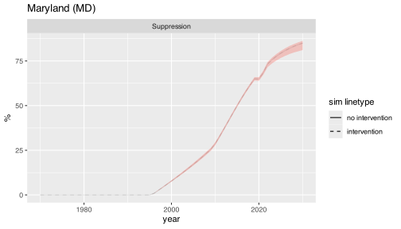
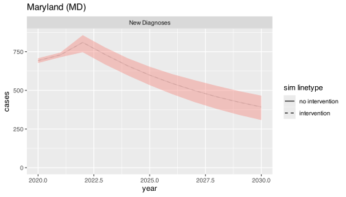
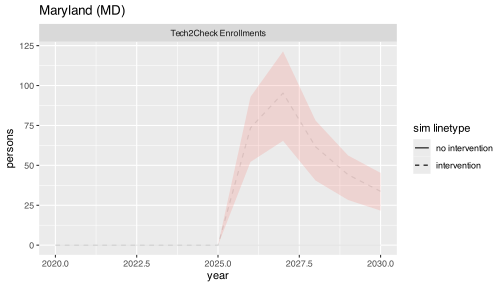
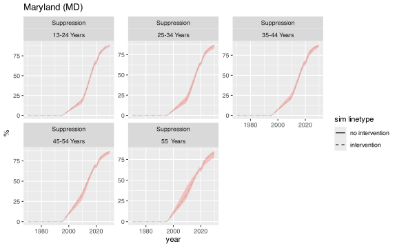
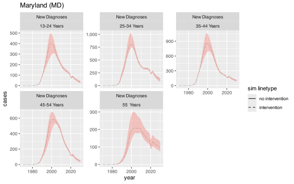
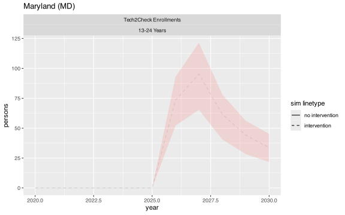
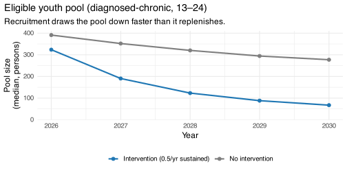

# Tech2Check — initial intervention results

## What this shows

Initial result from running the calibrated **Tech2Check intervention on
Maryland state-level baselines** (1000-sim posterior, sustained
recruitment over 2026–2030). Maryland state is the modeled geography
because current-spec MSA calibration is not yet available.

The simulated scenario is sustained recruitment of diagnosed-chronic
youth (13–24) into the four-state lifecycle
(`on_intervention → recently_intervened → distantly_intervened`), with
the trial OR (default 2.0) applied to suppression in `on_intervention`
and `recently_intervened` and OR = 1 in `distantly_intervened`.
Recruitment is held at 0.5/yr as a placeholder — not trial-derived. This
is a **universal-offer scenario** applied to all diagnosed-chronic youth
13–24 — broader than the trial’s actual enrollment, which targeted a
more viremic / adherence-challenged subgroup. Effects below are compared
against a no-intervention re-run of the same posterior at year 2030.
Standard structural and directional checks pass; the per-stratum OR
check (comparing the simulated suppression rate to what the OR formula
predicts at each stratum/year/sim cell) comes back within tolerance.

## Trajectories: intervention vs no-intervention

Time-series overlays of viral suppression, new diagnoses, and program
enrollment for the two scenarios.

**By age.**

## Population-level effects (2030)

| Outcome | Δ at 2030 (median) | CI low (2.5%) | CI high (97.5%) | % change vs no-intervention |
|:---|---:|---:|---:|---:|
| incidence | -0.56 | -1.36 | -0.08 | -0.133 |
| new | -0.58 | -1.91 | -0.03 | -0.276 |
| hiv.mortality | -0.09 | -0.13 | -0.02 | -0.017 |

Maryland, 1000-sim posterior, sustained 0.5/yr recruitment. Intervention
vs no-intervention at year 2030.

Absolute deltas are median per-sim differences (intervention −
no-intervention); percent changes are the ratio of median trajectories.
They’re slightly different aggregations, so the arithmetic doesn’t line
up exactly.

## The context — why the effect is small

A youth-only intervention is acting on roughly **1% of the diagnosed
prevalence**. In this calibrated MD model, the small youth pool combined
with the modeled suppression-to-transmission pathway bounds the
population-level effect to a fraction of a percent. The smallness is a
population-share story, not a recruitment-volume story.

## The eligible pool depletes under the intervention

Cumulative reach over the 4-year window is **~310 enrollees** (median;
95% CI 208–388). The intervention is mechanically doing its job —
recruiting youth into the lifecycle and depleting the eligible pool
faster than it replenishes. A natural next question: what would pushing
recruitment harder do?

## Recruitment sensitivity

| Recruitment rate (/yr) | Cum. enrollments by 2030 | Δ incidence at 2030 | Δ mortality at 2030 |
|:---|---:|---:|---:|
| 0.5 | 309 | -0.56 | -0.086 |
| 2 | 389 | -0.58 | -0.085 |
| 10 | 973 | -0.62 | -0.086 |

Maryland, 1000-sim posterior; sustained recruitment at three rates.
Intervention vs no-intervention at year 2030.

Pushing recruitment from 0.5/yr toward saturation (10/yr) roughly
triples cumulative reach and drains the eligible pool to ~6 by 2030, but
the median effects at 2030 barely move. The reach→impact curve is
effectively flat from the base case onward — the conclusion is bounded
by the size of the eligible pool, not by recruitment intensity. At
higher recruitment, the medians barely move but the spread across sims
widens — mortality at rate 10 has a CI that includes zero. So the “flat
ceiling” claim describes the median; per-sim uncertainty grows as
recruitment pushes higher.

## Where this could go

**Near-term, regardless of direction.**

- *Cross-state pool fractions and ceiling effects.* We have ~30
  state-level baselines available. Near-term: a descriptive pass on pool
  fractions and age composition state-by-state, testing whether the
  youth ≈ 1% finding is Maryland-specific or roughly universal.
  Follow-on: full multi-state intervention runs. Either tier strengthens
  the bounded-impact framing or opens a richer geographic story (e.g.,
  the same intervention having more leverage in states with different
  youth demographics).

- *Broadening the modeled population beyond youth, as a sensitivity.*
  Pure OR transport across ages isn’t defensible (the digital-health +
  peer-support modality plausibly attenuates with life-stage), but a
  family of scenarios varying the attenuation profile — from no
  transport, through partial transport, to full transport — bounds what
  happens to the pool-bound result when the eligible pool isn’t
  restricted to youth. A reviewer will probably ask for this regardless
  of the chosen contribution framing, so it’s worth doing proactively.

**Possible directions for the paper itself.**

- *Cost-effectiveness layer.* Even a small population effect can be
  cost-effective if the intervention is cheap. Pricing it as cost per
  active-suppression person-year gained converts the bounded-impact
  result into a sharper policy claim — “small but defensibly
  cost-effective” or “not worth it at this scale.” Needs Tech2Check
  program-cost inputs to exist; we haven’t checked.

- *Quantifying the structural ceiling as the contribution itself.* Frame
  what we already have — youth-only suppression interventions are
  structurally bounded to a small fraction of a percent at the state
  level by the pool size — as the paper’s main result. Lowest
  additional-work path; the measurement is in hand.
