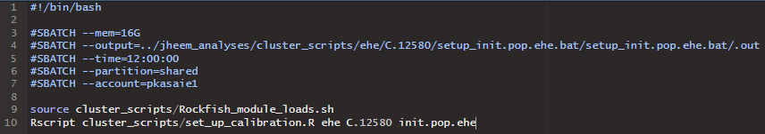
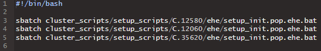

```{r, eval=FALSE}
source("cluster_scripts/batch_script_helpers.R")
MY_LOCATIONS = c("C.12580", "C.12060", "C.35620")
```

### Make batch scripts to set up calibrations for each of three locations.
```{r, eval=FALSE}
make.setup.scripts(MY_LOCATIONS,
                   version='ehe',
                   calibration.code='init.pop.ehe')
```

One of these might look like this:



### Make a master script to runs each of the above batch scripts with a single command.
```{r, eval=FALSE}
make.setup.master.script("my_example_setup_script",
                         locations=MY_LOCATIONS,
                         version='ehe',
                         calibration.code='init.pop.ehe')
```

This might look like this:



### Run this master script from the command line of an interact session on the cluster
```
sbatch cluster_scripts/master_scripts/setup/my_example_setup_script.bat
```

### Make batch scripts to run calibrations, then make a master script.
```{r, eval=FALSE}
make.run.scripts(MY_LOCATIONS,
                 version='ehe',
                 calibration.code='init.pop.ehe',
                 chains=1)
make.run.master.script("my_example_run_script",
                       locations=MY_LOCATIONS,
                       version='ehe',
                       calibration.code='init.pop.ehe',
                       chains=1)
```

### Run this master script from the command line of an interact session on the cluster
```
sbatch cluster_scripts/master_scripts/run/my_example_run_script.bat
```

### Check their progress
```
sqme
```

### Make an assemble script to assemble simsets from the calibrations
```{r, eval=FALSE}
# Burning the first 40% of simulations and then keeping every fifth from the remainder
make.combined.assemble.script("my_example_assemble_script",
                              locations=MY_LOCATIONS,
                              version='ehe',
                              calibration.code='init.pop.ehe',
                              burn.keep = 0.6,
                              thin.keep = 0.2)
```

### Run the assemble script once the calibrations are finished
```
sbatch cluster_scripts/assemble_scripts/my_example_assemble_script.bat
```

### Export the assembled simsets using SCP in the terminal of your local desktop
```
scp azalesak@rfdtn1.rockfish.jhu.edu:/scratch4/pkasaie1/azalesak/jheem/files/run_results/init.pop.ehe_simset_2024-12-16_C.12580.Rdata my_local_path/init.pop.ehe_simset_2024-12-16_C.12580.Rdata
scp azalesak@rfdtn1.rockfish.jhu.edu:/scratch4/pkasaie1/azalesak/jheem/files/run_results/init.pop.ehe_simset_2024-12-16_C.12060.Rdata my_local_path/init.pop.ehe_simset_2024-12-16_C.12060.Rdata
scp azalesak@rfdtn1.rockfish.jhu.edu:/scratch4/pkasaie1/azalesak/jheem/files/run_results/init.pop.ehe_simset_2024-12-16_C.35620.Rdata my_local_path/init.pop.ehe_simset_2024-12-16_C.35620.Rdata
```